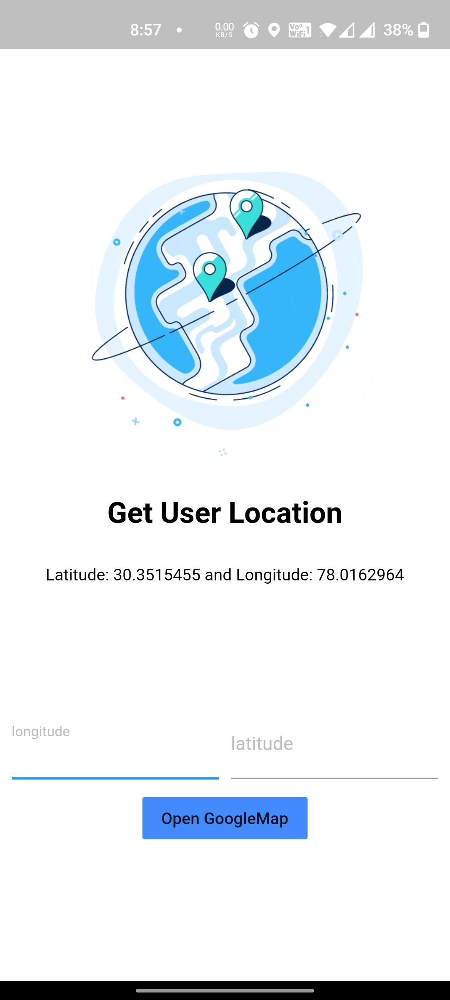
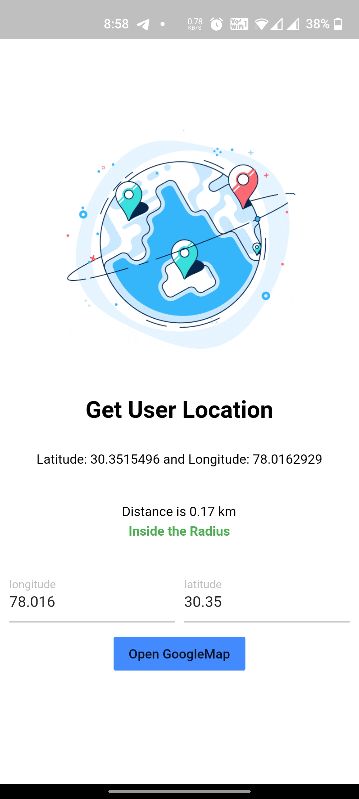
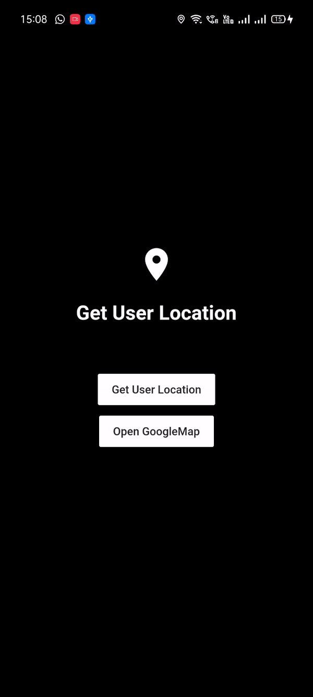

# CoolLocationTracker-flutter
Get User Current Location (Latitude and Longitude) and Open it in GoogleMaps and also find distance fron any Latitude and Longitude.

  
  
    

 

Keep doing what you do good!!
 
